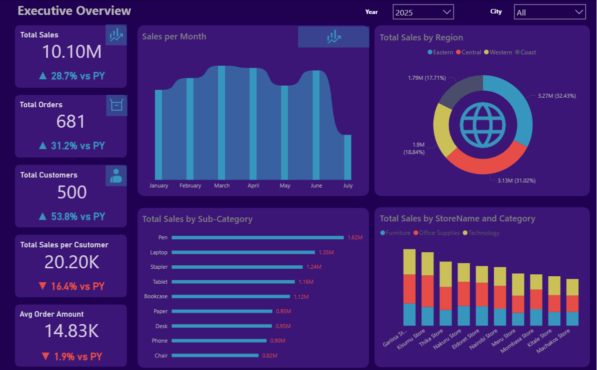

# 🧭 Executive Sales Overview Dashboard  

  

## 📘 Project Overview  
The **Executive Sales Overview Dashboard** is an interactive analytics project that visualizes key sales performance metrics across regions, stores, and product categories.  
It provides a top-level snapshot of business performance, highlighting growth trends, customer behavior, and product performance to support strategic decision-making.

---

## 🎯 Business Problem  
The challenge was the lack of a centralized view of sales performance across multiple business dimensions.  
Managers had to rely on static reports and fragmented data, making it difficult to track trends or identify key growth areas.  

This dashboard was created to:
- Consolidate sales data for clear visibility  
- Enable quick, data-driven decisions  
- Highlight underperforming segments and opportunities  

---

## 🧮 Key Metrics & Insights  

| Metric | Current Value | Change vs PY | Insight |
|:-------|---------------:|:-------------:|:--------|
| **Total Sales** | 10.10M | ⬆️ 28.7% | Significant overall growth year-over-year |
| **Total Orders** | 681 | ⬆️ 31.2% | More customer transactions processed |
| **Total Customers** | 500 | ⬆️ 53.8% | Strong customer acquisition |
| **Sales per Customer** | 20.20K | 🔻 16.4% | Slightly lower spend per customer |
| **Average Order Amount** | 14.83K | 🔻 1.9% | Stable order value, minimal decline |

**Overall Insight:**  
Sales, orders, and customers have grown impressively, but the drop in average spend per customer signals a need to improve retention or upsell strategies.

---

## 📅 Monthly Sales Trend  
- Sales climbed steadily from **January to May**, peaking in **March–April**.  
- A dip occurred in **June–July**, which may indicate **seasonal slowdown or inventory issues**.  

---

## 🌍 Regional Performance  

| Region | Total Sales | % Contribution |
|:--------|-------------:|:---------------:|
| **Eastern** | 3.27M | 32.43% |
| **Central** | 3.13M | 31.02% |
| **Western** | 1.90M | 18.84% |
| **Coast** | 1.79M | 17.71% |

➡️ **Eastern and Central regions** dominate, contributing over **63%** of total sales. These are high-priority growth regions.

---

## 🧩 Sales by Sub-Category  

| Sub-Category | Sales (M) |
|:--------------|-----------:|
| Pen | 1.62 |
| Laptop | 1.35 |
| Stapler | 1.24 |
| Tablet | 1.16 |
| Bookcase | 1.12 |
| Paper | 0.95 |
| Desk | 0.95 |
| Phone | 0.90 |
| Chair | 0.82 |

Top-selling products include **Pens** and **Laptops**, while **Chairs** and **Phones** could benefit from promotional focus or pricing review.

---

## 🏬 Store and Category Breakdown  
- **Garissa**, **Thika**, and **Nakuru** stores lead in total revenue.  
- **Office Supplies** and **Technology** outperform **Furniture** across most stores.  
- Balanced product diversity but with clear leaders emerging by store type.  

---

## 🧰 Tools & Technologies Used  
- **Power BI** – Dashboard design and visualization  
- **Excel** – Data cleaning, transformation, and validation  
- **Mockaroo** – Data generation for simulation  

---

## 🚀 Recommendations  
1. Focus expansion and marketing in **Eastern & Central regions**.  
2. Introduce **customer loyalty programs** to boost sales-per-customer.  
3. Address the **mid-year performance dip** with promotional campaigns.  
4. Reassess pricing and positioning for **low-performing sub-categories**.  
5. Continuously monitor **average order value** to maintain profitability.  

---

## 📈 Outcome  
This project demonstrates how data visualization can transform static reports into actionable insights.  
The dashboard provides executives and analysts with a real-time lens into performance, helping steer business strategy with confidence.  

---

## 👤 Author  
**Sam**  
> Data Analyst | Passionate about turning raw data into visual stories that drive impact.  
> [Connect on LinkedIn](#) *(optional link to your profile)*  
