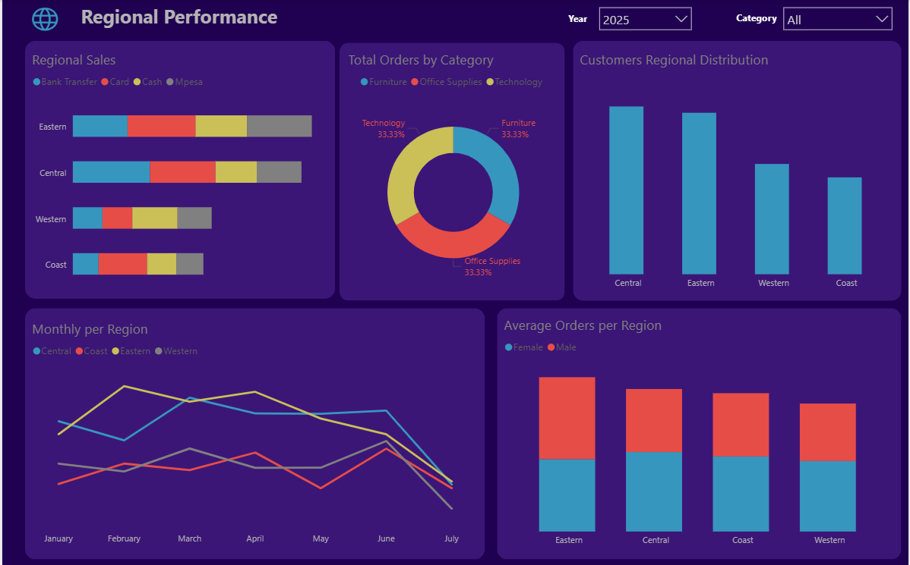
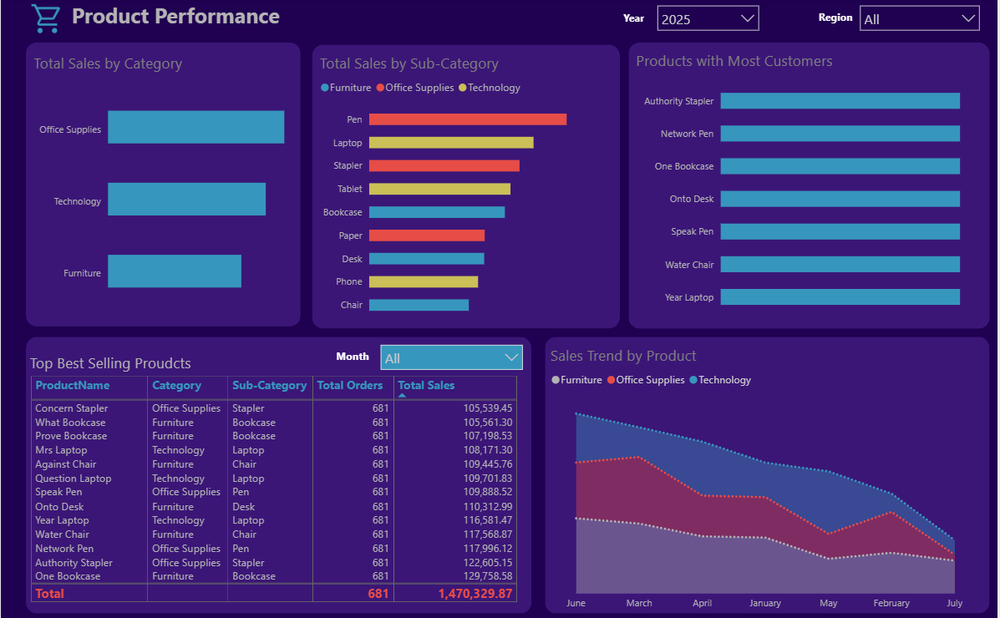

# 📊 Sales & Marketing Performance Dashboard for a Multi-Regional Retail Chain

## 🧾 Project Summary

This Power BI dashboard offers a powerful, interactive view into sales and marketing performance for a multi-regional retail business. Built for decision-makers, it simplifies complex datasets into meaningful KPIs and visuals to support real-time insights, strategic planning, and operational excellence.

---

## 📂 Dashboard Pages

### 1. Executive Overview
A strategic summary for C-level stakeholders:
- 📈 **Total Sales** and **Total Orders** with Year-over-Year (YoY) Growth
- 🧭 **Top/Bottom Regions** by Sales
- 💡 **Performance by Sub-Category**
- 📆 Monthly aTrend Lines

### 2. Regional Performance
Uncover geographic trends and contribution:
- 🗺️ **Sales by State and Region**
- 📦 **Order Volumes**
- 👤 **Monthly Orders per Region**
- 🔁 **Order Distribution by Category**

### 3. Product Performance
Zoom in on what’s working:
- 🏷️ **Top & Bottom Performing Products**
- 📊 **Sales by Sub-Category**
- ⚖️ **Discount Effects and Price Trends**
- 📉 **Units Sold vs Sales**

### 4. Customer Insights
Focus on audience behaviors and marketing outcomes:
- 👥 **Customer Segments**
- 🛒 **Spending Habits**
- 🔍 **Key Influencers (AI Visual)**
- 🌳 **Decomposition Tree Analysis**

---

## ⚙️ Technical Highlights

- ✅ **Custom DAX Measures** used in the dashboard:
  - `Total Profit = SUM(Superstore[Profit])`
  - `Profit Margin = DIVIDE([Total Profit], [Total Sales])`
  - `YoY Sales Growth = DIVIDE(([Total Sales] - [PY Sales]), [PY Sales])`
  - `YoY Profit Growth = DIVIDE(([Total Profit] - [PY Profit]), [PY Profit])`
  - `Average Order Value = DIVIDE([Total Sales], DISTINCTCOUNT(Superstore[Order ID]))`
  - `Customer Count = DISTINCTCOUNT(Superstore[Customer ID])`
  - `Top N Products = TOPN(10, VALUES(Superstore[Product Name]), [Total Sales])`

- ✅ **Time Intelligence** leveraging:
  - `SAMEPERIODLASTYEAR()`
  - `TOTALYTD()`
  - `DATEADD()` for custom comparisons

- ✅ **Advanced AI Visuals**:
  - **Key Influencers**: Analyzes what factors influence profit
  - **Decomposition Tree**: Breaks down high/low performance by user-defined categories

- ✅ **Slicers & Filters**:
  - Interactive filters by Category, Segment, Region, Year, and Quarter

---

## 💼 Business Value

This dashboard equips teams to:
- ✅ Monitor sales and profit in real-time across regions
- ✅ Identify high-performing products and struggling areas
- ✅ Understand customer segments and their behaviors
- ✅ Align marketing and sales efforts with data insights

---

## 🧰 Requirements

- Microsoft Power BI Desktop (May 2023 or later)
- Cleaned Superstore-style dataset with:
  - Proper data types (currency, dates)
  - No missing values or duplicates

---

## 📸 Sample Visuals

  
  
  

---

## 👨‍💻 Developed By

**Samuel Mati**  
Data Analyst & Automation Specialist  
📧 [Email](sammxsaf@gmail.com)  
🌐 [LinkedIn](https://www.linkedin.com/in/samuel-mati/)

---

> 🚀 *Transforming retail analytics into business clarity.*
